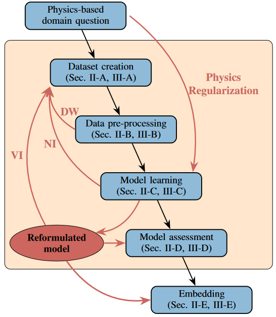
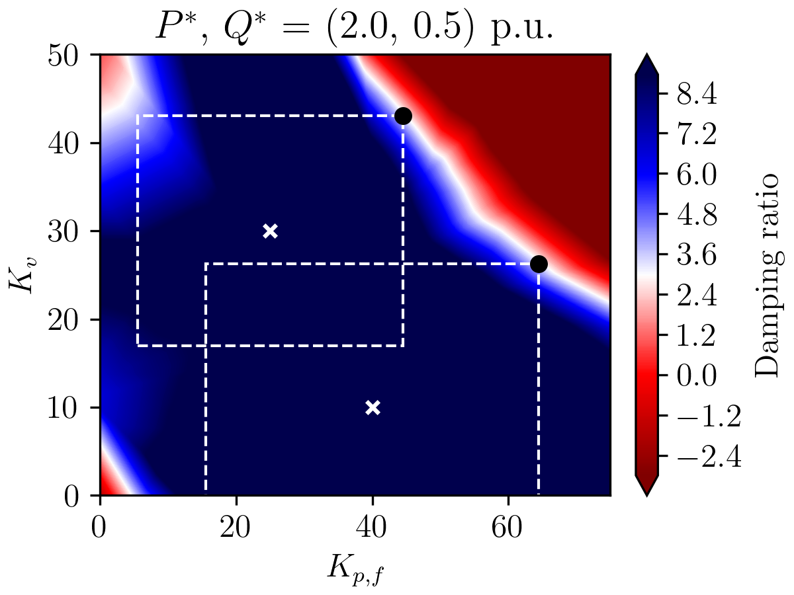

# Closing the Loop: A Framework for Trustworthy Machine Learning in Power Systems

This repository is the official implementation
of [Closing the Loop: A Framework for Trustworthy Machine Learning in Power Systems](https://arxiv.org/abs/2203.07505)
which has been subbmitted to the "11th Bulk Power Systems Dynamics and Control Symposium, July 25-30, 2022, Banff, Canada"

------------------------------------------

## Installation

To install and activate the environment using conda run:

```setup
conda env create -f environment.yml
conda activate irep_2022
```

The file `environment_linux.yml` contains a similar environment for linux machines. 

## WandB for logging and run configuration

The present implementation relies on the platform 'WandB' for configuring, launching, and logging the different runs.
The simplest configuration is shown in `workflow.py`, for the hyperparameter tuning refer
to `create_hyperparameter_sweep.py` and `run_agent_from_sweep_id.py`. Wandb requires an account (free for light-weight
logging, as it is the case here) and an API key for the login, see their webpage for further details.
`definitions.py` holds then the values for the entity and project to which the runs should be allocated.
`retrieve_data_from_wandb.py` shows how, e.g., the trained model can be downloaded after it is stored in the WandB
cloud. This was preferred over keeping a local copy for all runs.

The free version comes with limits on the number of simultaneous agents and upload rates, therefore a mindful logging is
encouraged.

## Code structure

`workflow.py` constitutes the central file which brings together all the different modules into a coherent workflow. The
following section describe the modules a little more detailed. The modules `dataset_creation`, `preprocessing`,
`neural_network_training`, and `verification` are implemented according to the proposed framework in the paper (and
shown below). The module `utils` collects a number of functions that are generally of use and not tied to a specific
module. The file `definitions.py` attempts to gather all parameters across the project that should be globally
accessible or would be hardcoded otherwise.



### Dataset creation

This module contains the dataset creation, all functions starting with 'NSWPH' (North Sea Wind Power Hub) are specific
to the case study and would be replaced for a different problem setting. As the dataset creation process is fairly
lengthy, all dataset are saved in the folder `data`. The dataset creation method along with the number of points forms
the identifier, e.g., `Grid_5` is the data collection on a grid with 4^5 points.

The calculations can be sped up by using `numba` to compile the code as C code, the implementation as is though, might
cause errors.

**Descriptions of the data files (.pkl files)**

- Input_Data.pkl
    - Each row: the parameters associated with a single operating point
    - Col 1: Active Power (P) Reference for all turbines [min: 0, max: 2]
    - Col 2: Reactive Power (Q) Reference for all turbines [min: -0.5, max: 0.5]
    - Col 3: Frequency Regulation Droop (Kpf) for all turbines [min: 0, max: 75]
    - Col 4: Voltage Regulation Droop (Kv) for all turbines [min: 0, max: 50]

- Output_Data.pkl
    - Each row: the damping ratios (between +100 and -100) associated with a single operating point
    - Col 1: minimum eigenmode damping ratio (less than 500 Hz) across all N-1 contingencies

- Eigenvalue_Data.pkl
    - Each row: the eigenvalues associated with a single operating point
    - Col 1: real part (\sigma) of the eigenvalue
    - Col 2: imaginary part (\omega) of the eigenvalue

- Jacobian_Data.pkl
    - Each row: the sensitivities associated with a single operating point
    - Col 1: dDamping_dP
    - Col 2: dDamping_dQ
    - Col 3: dDamping_dKpf
    - Col 4: dDamping_dKv

**Data Collection Routines**:

- **Grid**: sample points from an evenly spaced grid
- **LHC**: Latin Hyper Cube (LHC) samples
- **Uniform**: sample points from a uniform distribution
- **TEST**: sample points from an evenly spaced grid with 4^21 points
- **DW**: (additional) sample points from the directed walk procedure

### Preprocessing

In the present case study, this step solely is used for a data exploration (analysing the class imbalance) and to define
the data structure that is used in the training process.

### Neural network training

`core_network.py` contains the setup of the neural network (inherits from torch.nn.Module),
whereas `dataset_functions.py`, `neural_network_functions.py`, and `resampling_functions.py`
define the interactions of the neural network throughout the training steps in the workflow.

### Verification

`verification_model.py` sets up a class that contains the reformulated neural network. It implements several methods for
bound tightening (analytical and optimisation based) and to verify the behaviour around a reference point.

`verification_plots.py` is used to create plots as follows.



## Used packages and programs

The implementation of the neural network training is done in [pytorch](https://pytorch.org/). The neural network
verification is implemented using [pyomo](http://www.pyomo.org/). We furthermore use [Gurobi](https://www.gurobi.com)
for solving the resulting optimization problems. As mentioned above, the logging and run configuration
utilises [WandB](https://wandb.ai).

## Citation

```
@misc{Stiasny_closing_the_loop_2022,
  author = {Stiasny, Jochen and Chevalier, Samuel and Nellikkath, Rahul and Sævarsson, Brynjar and Chatzivasileiadis, Spyros},
  title = {Closing the Loop: A Framework for Trustworthy Machine Learning in Power Systems},
  publisher = {arXiv},
  year = {2022},
  doi = {10.48550/ARXIV.2203.07505},
  url = {https://arxiv.org/abs/2203.07505},
}
```


